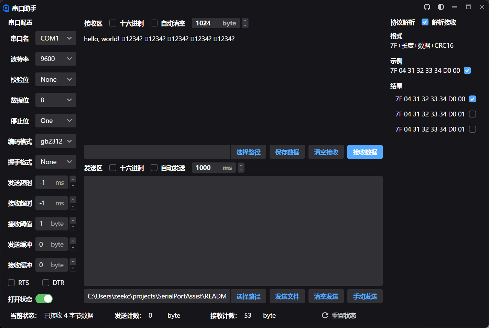
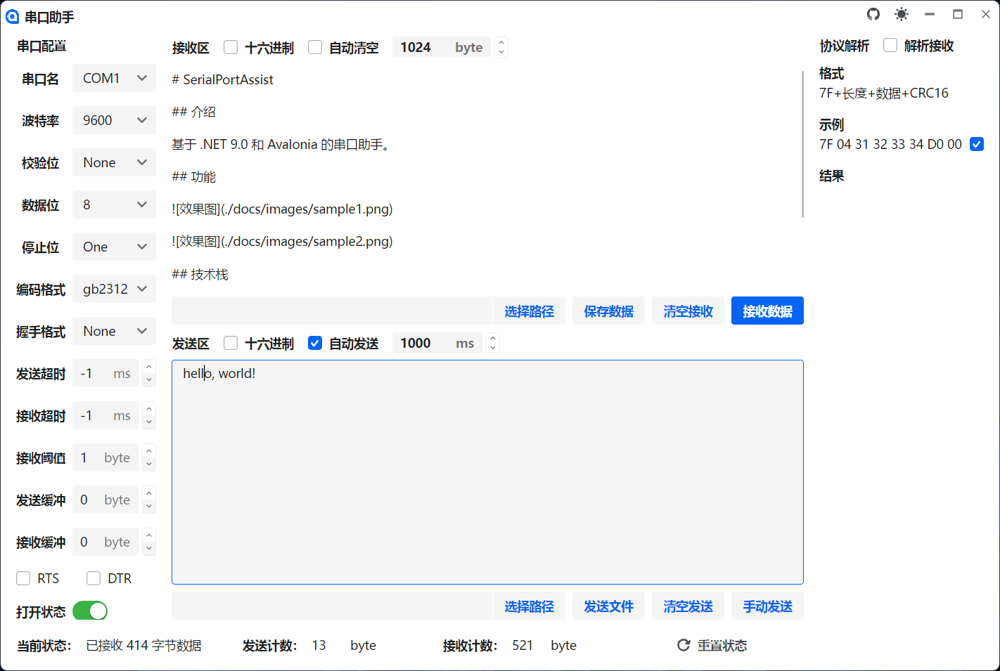

# SerialPortAssist

## 介绍

基于 .NET 9.0 和 Avalonia 的串口助手。

## 功能

## 技术栈

- [.NET 9.0](https://dotnet.microsoft.com/en-us/download/dotnet/9.0)
- [Avalonia](https://github.com/avaloniaui/avalonia)
- [Semi.Avalonia](https://github.com/irihitech/Semi.Avalonia)
- [Ursa.Avalonia](https://github.com/irihitech/Ursa.Avalonia)
- [CommunityToolkit.Mvvm](https://learn.microsoft.com/zh-cn/dotnet/communitytoolkit/mvvm/)
